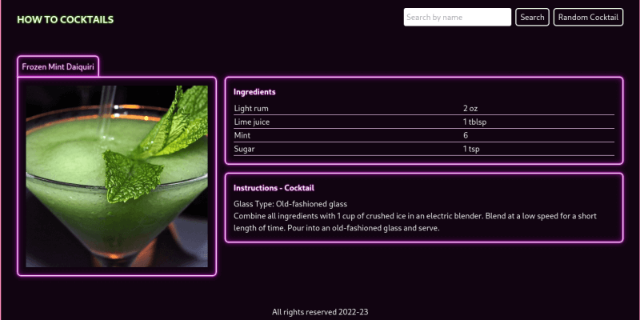
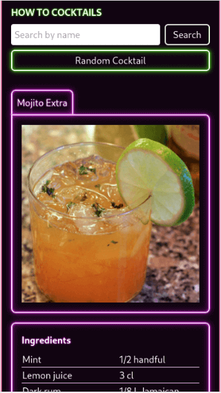

# How to Cocktail :cocktail:

A cocktails recipe react app, do you want to create your next refreshing drink? look no further. Built for a School of Code Hackathon Friday.


## Features

- Responsive


## Run Locally

Clone the project

```bash
  git clone https://link-to-project
```

Go to the project directory

```bash
  cd my-project
```

Install dependencies

```bash
  npm install
```

Start the server

```bash
  npm start
```


## Screenshots

**large screens**



**mobile screens**




## Color Reference

| Color             | Hex                                                                |
| ----------------- | ------------------------------------------------------------------ |
| Razzmatazz |  #F31770 |
| Fuchsia |  #F71FF9 |
| White |  #ffffff |
| Screaming green |  #8FFE6B |
| Licorice |  #110411 |


## API Reference

#### Get a random cocktail

```http
  GET /api/json/v1/1/random.php
```

#### Search for specific cocktail

```http
  GET /api/json/v1/1/search.php?s=${text}
```

| Parameter | Type     | Description                       |
| :-------- | :------- | :-------------------------------- |
| `${text}` | `string` | text to search for |


## Tech Stack

**Client:** React, TailwindCSS, HTML5, CSS3


## Hackathon instructions


### Task 1 - API Research (20 - 30 mins) :heavy_check_mark:

Choose at least one API to fetch from in a full stack React app. This [list](https://apilist.fun) may help. Remember to read the API's documentation and send test requests from Postman to view the data you get back first before deciding it's suitable to use. You can always use the API list we used in the hackathon earlier in the course as well.

### Task 2 - Ideate and Plan (30 - 60 mins) :heavy_check_mark:

- Once you choose an API and test it out, use Disney ideation to come up with an idea of what you want to build. Set a timer for each room (dreamer, realist, and critic).
- Boil down what your MVP is and what then becomes stretch goals. Break down your idea into its component parts and prioritise your tasks. Use project management software like [Trello](https://trello.com/en) to organize your plan, breaking it down into tasks that you can then treat as tickets for each feature. Base each of these around a [user story](https://www.atlassian.com/agile/project-management/user-stories).
- Create a component tree with state and behaviour for each component and at least low-fidelity wireframes for your design.

### Task 3 - Build your MVP :heavy_check_mark:

Build the simplest version of your app (just enough features to be useable). Make regular commits as you build, and practice branching off for each component and merging that branch in. Use the React hooks and tools we've looked at over the past weeks where appropriate.

### Stretch Goals :heavy_check_mark:

Once your MVP is functioning and if you have time left, focus on what features you are going to build next - iterate through your planned stretch goals one by one. Again, make use of feature branching and atomic commits (committing often after each change).

### Retro :heavy_check_mark:

You'll be presenting your apps to each other, and each team member should be prepared to present about their app so an end of day wrap-up is a good idea. This is a good time to practice an [agile retrospective](https://www.atlassian.com/team-playbook/plays/retrospective) - leave time before presentations to discuss what you did well today, what you learned, what you might do differently next time, and actions you can take forward into your project next week.


## What I learned

After completing the hackathon with my partner for the week, Jack, I decided to finish off the interface and at the same time experience a new technology. 
The new technology I chose was [Tailwind](https://tailwindcss.com/) and I am really impressed with it. I have to admind that after my experience with MaterialUI I was reluctand to try it out but they got it right.
Because of my experience with Bootstrap the learning curve was not steep at all, I just needed to have a quick look at the utilities they offered and how they were used. The library offers really good default settings, which are ready to go and do produce a recent interface, however the ability to create custom utilities is what did it for me. Unlike most, tailwind actually makes it easy and straight forward to add your custom utilities as one offs or in the config file so that it intergrates seemless with the app.

I will start using tailwind in all my projects from now. This does not mean I will close the doors on other libraries made for similar purpose as I will keep on trying out and learning new techs. To me Tailwind is a winner.


## Roadmap

- Light/dark mode toggle
- Search for cocktail by ingredients.


## Acknowledgements

 - [Tailwindcss Documentation](https://tailwindcss.com/docs/installation) to the people involved in the creation and planning. Amazing piece of tech.


## Authors

- [Jack Cherry](https://github.com/JackC91)
- [Carlos E Alford](https://carlosealford.com/)


## License

[MIT](https://choosealicense.com/licenses/mit/)
