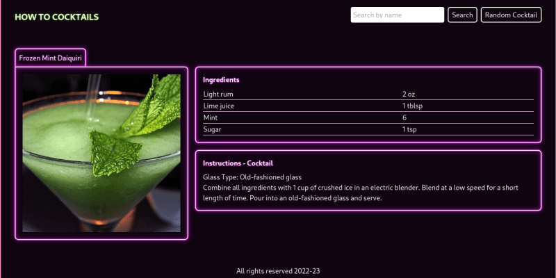
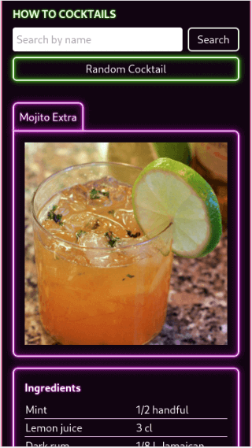

# How to Cocktail :cocktail:

A cocktails recipe react app, do you want to create your next refreshing drink? look no further.

:cocktail: [How to Cocktails](https://webshuriken.github.io/soc-w8-how-to-cocktail/)

## About

Built for a School of Code Hackathon Friday. To practice using APIs and the cocktails one seem like the most fun.

See [hackathon](HACKATHON.md) for instructions.

**large screens**



**mobile screens**



## Tech Stack

- React
- TailwindCSS
- HTML5
- CSS3

## Run Locally

Clone the project

```bash
git clone https://github.com/webshuriken/soc-w8-how-to-cocktail
```

Install dependencies

```bash
cd my-project
npm install
```

Start the server

```bash
npm start
```

## Features

- Responsive
- Queries API for a random drink
- Search bar with debouncing to reduce API requests

## API Reference

### Get a random cocktail

```http
GET /api/json/v1/1/random.php
```

### Search for specific cocktail

```http
GET /api/json/v1/1/search.php?s=${text}
```

| Parameter | Type     | Description                       |
| :-------- | :------- | :-------------------------------- |
| `${text}` | `string` | text to search for |

## Roadmap

### Version 1.0.0 - hackathon

- [X] API Research
- [X] Ideate and Plan
- [X] Build your MVP
- [X] Stretch Goals

### Version 1.2.0

- [ ] Light/dark mode toggle
- [ ] Search for cocktail by ingredients.

## Acknowledgements

 - [Tailwindcss Documentation](https://tailwindcss.com/docs/installation) to the people involved in the creation and planning. Amazing piece of tech.

## Authors

- [Jack Cherry](https://github.com/JackC91)
- [Carlos E Alford](https://carlosealford.com/)

## License

[MIT](LICENSE)
